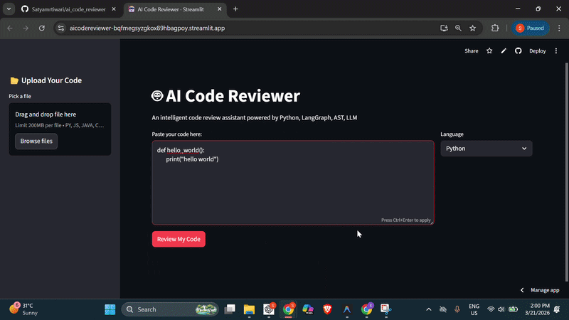

# 🤖 AI Code Reviewer

 


An intelligent, multi-agent code review assistant powered by **LangGraph**, **Python AST**, and **Groq Cloud LLMs** (`llama-3.3-70b-versatile`).

## 🌐 Live Demo
👉 [https://your-link.com](https://aicodereviewer-bqfmegsyzgkox89hbagpoy.streamlit.app/)

## 🎥 Demo



## ✨ Features

- **5-Agent Pipeline** — AST Analyzer → Bug Detector → Quality Reviewer → Report Generator → Code Rewriter
- **Multi-Language Support** — Python, JavaScript, Java, C, and C++
- **File Upload** — Drag and drop any code file for instant review with auto-language detection
- **Bug Detection** — Identifies logical errors, runtime issues, unused variables, and security vulnerabilities
- **Quality Score** — Rates code out of 100 with specific improvement suggestions
- **Rewrite Full Code** — LLM rewrites your code with all bugs fixed, docstrings added, and best practices applied
- **Download Rewritten Code** — One-click download of the improved version

## 🛠️ Local Setup

1. **Clone the repo**:
   ```bash
   git clone https://github.com/Satyamrtiwari/ai_code_reviewer.git
   cd ai_code_reviewer
   ```

2. **Create a virtual environment and install dependencies**:
   ```bash
   python -m venv review
   review\Scripts\activate      # Windows
   pip install -r requirements.txt
   ```

3. **Set up your API key** — Create a `.env` file:
   ```env
   GROQ_API_KEY=your_groq_api_key_here
   ```
   > Get a free key at [console.groq.com](https://console.groq.com)

4. **Run the app**:
   ```bash
   python run.py
   # OR
   streamlit run app.py
   ```

## 💓 Health Check & Uptime Monitoring

This application includes custom route patching for **Uptime Robot** and other ping services:

- **Primary Health Check URL**: `http://<your-host>:<port>/health` (Returns HTTP `200 OK` with body `ok`)
- **Alternative Health Check URLs**: `http://<your-host>:<port>/healthz` or `http://<your-host>:<port>/_stcore/health`

### Setting up Uptime Robot:
1. Log in to [Uptime Robot](https://uptimerobot.com/).
2. Click **Add New Monitor**.
3. Select **HTTP(s)** as Monitor Type.
4. Set URL to `https://<your-deployed-app-domain>/health` (e.g. `https://ai-code-reviewer.streamlit.app/health` or custom domain).
5. Set Monitoring Interval to 5 minutes.

## ☁️ Streamlit Cloud Deployment

1. Push this project to **GitHub**.
2. Go to [share.streamlit.io](https://share.streamlit.io/) and connect your repo.
3. Set `app.py` (or `run.py`) as the main file.
4. In **Settings → Secrets**, add:
   ```toml
   GROQ_API_KEY = "your_groq_api_key_here"
   ```

## 📁 Project Structure

```
ai_reviewer/
├── app.py                    # Streamlit frontend with Tornado health patch
├── run.py                    # Production entrypoint with pre-configured /health route
├── agents/
│   ├── ast_analyzer.py       # Agent 1 — Static code analysis (Python only)
│   ├── bug_detector.py       # Agent 2 — Bug & security detection via LLM
│   ├── quality_reviewer.py   # Agent 3 — Code quality scoring via LLM
│   ├── report_generator.py   # Agent 4 — Generates structured report
│   └── code_rewriter.py      # Agent 5 — Rewrites code with fixes applied
├── graph/
│   ├── state.py              # LangGraph shared state definition
│   └── workflow.py           # LangGraph pipeline orchestration
├── utils/
│   └── groq_client.py        # Groq LLM client setup
├── requirements.txt
├── .env.example
└── .gitignore
```

## 📦 Requirements

```
langchain-groq
langgraph
streamlit
radon
python-dotenv
```

